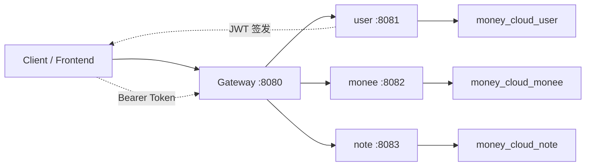

# money-cloud 项目介绍

## 1. 项目概述

`money-cloud` 是基于 `Spring Boot 3.2.12 + Spring Cloud 2023.0.6` 的标准 Maven 多模块微服务项目，用于将当前目录下原有的 `money` 单体 Spring Boot 记账后端拆分为网关、用户、记账、笔记和公共能力模块。

本项目包含以下目标：

- 保留原 `money` 单体的记账、预算、分类、统计功能，并整体迁移到 `monee` 微服务
- 新增 `user` 用户中心，实现邮箱验证码注册、JWT 登录和当前用户信息获取
- 新增 `note` 笔记服务，提供当前登录用户的基础 CRUD 和分页能力
- 新增 `gateway` 网关，统一入口、路由转发和跨域处理
- 新增 `common` 公共模块，沉淀统一响应、全局异常、JWT 工具、邮件工具、公共配置

## 2. 模块结构

```text
money-cloud
├── pom.xml
├── PROJECT_INTRODUCE.md
├── API_INTERFACE.md
├── sql
│   ├── user.sql
│   ├── note.sql
│   └── monee.sql
├── common
├── gateway
├── user
├── monee
└── note
```

## 3. 架构图



## 4. 模块说明

### 4.1 common

- 统一返回结构 `ApiResponse`
- 全局异常处理 `GlobalExceptionHandler`
- MyBatis-Plus 分页配置 `MybatisPlusConfig`
- MVC 跨域配置 `WebMvcCorsConfig`
- JWT 工具 `JwtUtil`
- 邮件工具 `MailUtil`
- 登录用户上下文 `UserContext`
- 安全组件 `JwtAuthenticationFilter`、`JwtAuthenticationEntryPoint`

### 4.2 gateway

- 端口 `8080`
- 基于 `Spring Cloud Gateway`
- 路由规则：
  - `/user/**` -> `http://localhost:8081`
  - `/monee/**` -> `http://localhost:8082`
  - `/note/**` -> `http://localhost:8083`
- 使用 `StripPrefix=1`，网关会去掉首段服务前缀后再转发

### 4.3 user

- 端口 `8081`
- 功能：
  - 发送注册邮箱验证码
  - 用户注册
  - 用户登录并返回 JWT Token
  - 获取当前登录用户信息
- 密码存储：`BCrypt`
- 验证码有效期：`5分钟`

### 4.4 monee

- 端口 `8082`
- 完整迁移原 `money` 单体业务
- 提供：
  - 月预算查询与设置
  - 每日可用预算查询
  - 分类增删改查
  - 记账记录增删改查与分页过滤
  - 月度/年度统计、分类统计、趋势统计
- 原有固定用户 `DEFAULT_USER_ID = 1L` 已改造为从 JWT 登录态中获取当前用户

### 4.5 note

- 端口 `8083`
- 功能：
  - 新增笔记
  - 删除笔记
  - 修改笔记
  - 查询单条笔记
  - 分页查询当前用户笔记列表

## 5. 技术栈

- Spring Boot 3.2.12
- Spring Cloud 2023.0.6
- Spring Cloud Gateway
- Spring Security 6 + JWT
- Spring Mail
- MyBatis-Plus 3.5.7
- MySQL 8
- Lombok
- Maven 多模块

## 6. 数据库说明

本项目按服务拆分数据库，默认使用三个独立库：

- `money_cloud_user`
- `money_cloud_monee`
- `money_cloud_note`

初始化脚本位于：

- `sql/user.sql`
- `sql/monee.sql`
- `sql/note.sql`

## 7. 启动顺序

建议启动顺序：

1. 创建三个 MySQL 数据库并执行 SQL
2. 修改各服务 `application.yml` 中的数据库账号密码
3. 修改 `user` 服务中的 `spring.mail.username` 和 `spring.mail.password`
4. 启动 `user`
5. 启动 `monee`
6. 启动 `note`
7. 启动 `gateway`

## 8. 启动命令

在根目录执行：

```bash
mvn clean package
```

分别启动：

```bash
mvn -pl user spring-boot:run
mvn -pl monee spring-boot:run
mvn -pl note spring-boot:run
mvn -pl gateway spring-boot:run
```

## 9. 鉴权说明

- 注册和登录在 `user` 服务中完成
- 登录成功后返回 JWT Token
- 访问 `monee` 和 `note` 时需要在请求头中携带：

```text
Authorization: Bearer <token>
```

- `gateway` 当前为基础版，不额外做鉴权拦截，只负责转发
- 各业务服务内部使用 Spring Security + JWT Filter 解析登录态

## 10. 迁移说明

原 `money` 单体中的以下内容已迁移到 `monee`：

- `controller`
- `service`
- `mapper`
- `entity`
- `dto`
- `mapper XML`
- 原有预算、分类、记录、统计业务逻辑

同时完成以下微服务化改造：

- 包名由 `com.money` 调整为 `com.money.cloud.monee`
- 通用能力下沉到 `common`
- 固定用户逻辑改为 JWT 当前用户上下文
- 启动类、配置文件、依赖与安全链独立化

## 11. 配置说明

### 11.1 网关转发前缀

由于网关配置了 `StripPrefix=1`，因此最终访问方式如下：

- 用户服务通过 `/user/...`
- 记账服务通过 `/monee/...`
- 笔记服务通过 `/note/...`

例如：

- `POST /user/auth/login`
- `GET /monee/api/statistics/monthly`
- `GET /note/notes`

### 11.2 JWT 配置

每个需要鉴权的服务都在各自的 `application.yml` 中配置了：

- `security.jwt.secret`
- `security.jwt.expire-seconds`

### 11.3 邮件配置

`user` 模块需要修改：

- `spring.mail.username`
- `spring.mail.password`

否则验证码邮件无法发送。
