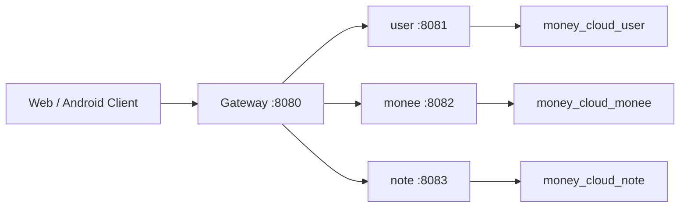

# money-cloud

`money-cloud` 是 `Monee` 系统的 Spring Cloud 微服务后端，基于 `Spring Boot 3.2.x + Spring Cloud 2023.0.x` 构建，将原单体记账项目拆分为网关、用户、记账、笔记和公共能力模块。

## 模块说明

- `gateway`：统一入口，负责路由转发、跨域处理
- `user`：用户注册、登录、邮箱验证码、JWT 身份认证、用户资料维护
- `monee`：原 `money` 单体业务迁移模块，负责记账、预算、分类、统计
- `note`：工作笔记、密码保险箱、待办事项、待办邮件提醒
- `common`：统一返回、全局异常、JWT 工具、过滤器、邮件工具、通用配置

## 技术栈

- Spring Boot 3.2.12
- Spring Cloud 2023.0.6
- Spring Cloud Gateway
- Spring Security 6
- JWT
- Spring Mail
- MyBatis-Plus 3.5.7
- MySQL 8
- Maven Multi Module
- Lombok

## 架构图



## 项目结构

```text
money-cloud
├─ common
├─ gateway
├─ user
├─ monee
├─ note
├─ sql
├─ pom.xml
├─ README.md
├─ PROJECT_INTRODUCE.md
└─ API_INTERFACE.md
```

## 核心能力

### 用户模块

- 邮箱验证码注册
- 邮箱密码登录
- BCrypt 密码加密
- JWT 登录态，默认有效期 2 年
- 获取当前用户信息
- 修改昵称与密码
- 密码验证（保险箱二次鉴权）

### 记账模块

- 分类增删改查
- 记录增删改查
- 预算设置与预算剩余
- 月统计、年统计、分类统计、趋势统计
- 所有数据按登录用户隔离

### 笔记模块

- 工作笔记 CRUD，支持软删除、回收站、恢复、彻底删除
- 笔记分类、标签、摘要、富文本内容
- 笔记内容类型：富文本(HTML) / Markdown 双模式
- 笔记置顶、收藏
- 笔记模板：系统预置模板 + 用户自定义模板
- 全局搜索：跨笔记/保险箱/待办的全文检索
- 密码保险箱，后端 AES 加密存储
- 待办事项 CRUD，支持状态切换、优先级、截止日期
- 待办邮件提醒：支持提醒时间、提醒邮箱，默认发到当前账号邮箱
- 用户操作活动日志：记录笔记/保险箱/待办的创建、更新、删除操作
- 日历日程管理：事件 CRUD、月视图/周视图查询、日期范围查询、全天事件、颜色标签
- 知识库 Wiki：多知识库空间、树形页面结构、无限层级子页面、页面内容编辑
- 文件库：文件上传（服务器本地存储）、下载、预览（图片/PDF/文本）、虚拟文件夹分类、搜索、危险文件扩展名黑名单
- 笔记-文件双向关联：笔记可关联文件库文件，文件可查看关联的笔记和知识库页面
- 知识库页面-文件双向关联：知识库页面可关联文件库文件，文件可查看关联的知识库页面
- 工作台增强：全模块数据总览、本周效率报告、知识增长曲线、活动热力图、优先待办列表

## 环境要求

- JDK 17
- Maven 3.9+
- MySQL 8

## 数据库

默认使用三个库：

- `money_cloud_user`
- `money_cloud_monee`
- `money_cloud_note`

初始化脚本位于：

- [sql/user.sql](./sql/user.sql)
- [sql/monee.sql](./sql/monee.sql)
- [sql/note.sql](./sql/note.sql)

增量脚本：

- [sql/note_migration_20260412.sql](./sql/note_migration_20260412.sql)
- [sql/todo-reminder-upgrade.sql](./sql/todo-reminder-upgrade.sql)
- [sql/note_upgrade_20260501.sql](./sql/note_upgrade_20260501.sql)（笔记软删除 + 活动日志表）
- [sql/note_upgrade_20260501_v2.sql](./sql/note_upgrade_20260501_v2.sql)（笔记内容类型、置顶、收藏、笔记模板表）
- [sql/note_upgrade_20260501_v3.sql](./sql/note_upgrade_20260501_v3.sql)（日历日程表、知识库空间表、知识库页面表）
- [sql/note_upgrade_20260501_v4.sql](./sql/note_upgrade_20260501_v4.sql)（文件库表）
- [sql/note_upgrade_20260501_v5.sql](./sql/note_upgrade_20260501_v5.sql)（笔记-文件关联表）
- [sql/note_upgrade_20260501_v6.sql](./sql/note_upgrade_20260501_v6.sql)（知识库页面-文件关联表）

## 配置说明

仓库中的 `application.yml` 已改为环境变量占位形式，不再直接提交生产密码。

### 常用环境变量

```text
MYSQL_HOST
MYSQL_PORT
MYSQL_USERNAME
MYSQL_PASSWORD
MAIL_HOST
MAIL_PORT
MAIL_USERNAME
MAIL_PASSWORD
MAIL_PROTOCOL
MAIL_SMTP_AUTH
MAIL_SMTP_STARTTLS_ENABLE
MAIL_SMTP_SSL_TRUST
JWT_SECRET
JWT_EXPIRE_SECONDS
VAULT_SECRET
```

### 推荐示例

```bash
set MYSQL_HOST=127.0.0.1
set MYSQL_PORT=3306
set MYSQL_USERNAME=root
set MYSQL_PASSWORD=your-password
set MAIL_USERNAME=your-qq@qq.com
set MAIL_PASSWORD=your-mail-auth-code
set JWT_SECRET=your-jwt-secret
set JWT_EXPIRE_SECONDS=63072000
set VAULT_SECRET=your-vault-secret
```

Linux:

```bash
export MYSQL_HOST=127.0.0.1
export MYSQL_PORT=3306
export MYSQL_USERNAME=root
export MYSQL_PASSWORD=your-password
export MAIL_USERNAME=your-qq@qq.com
export MAIL_PASSWORD=your-mail-auth-code
export JWT_SECRET=your-jwt-secret
export JWT_EXPIRE_SECONDS=63072000
export VAULT_SECRET=your-vault-secret
```

## 启动方式

### 1. 构建

```bash
mvn clean package
```

### 2. 分模块启动

```bash
mvn -pl user spring-boot:run
mvn -pl monee spring-boot:run
mvn -pl note spring-boot:run
mvn -pl gateway spring-boot:run
```

### 3. 访问入口

网关默认端口：

```text
http://localhost:8080
```

路由规则：

- `/user/**` -> `user`
- `/monee/**` -> `monee`
- `/note/**` -> `note`

## 鉴权说明

- 注册和登录在 `user` 模块完成
- 登录成功后返回 JWT Token
- 访问 `monee` 和 `note` 业务接口时，请在请求头中携带：

```text
Authorization: Bearer <token>
```

- 网关当前为基础转发版，不额外做统一鉴权拦截
- 实际鉴权由各业务服务内部的 Spring Security + JWT Filter 完成

## 文档

- 项目介绍：[PROJECT_INTRODUCE.md](./PROJECT_INTRODUCE.md)
- 接口文档：[API_INTERFACE.md](./API_INTERFACE.md)

## 关联前端

- Android 客户端：`Monee-app`
- 笔记 Web 前端：`Note-web`
